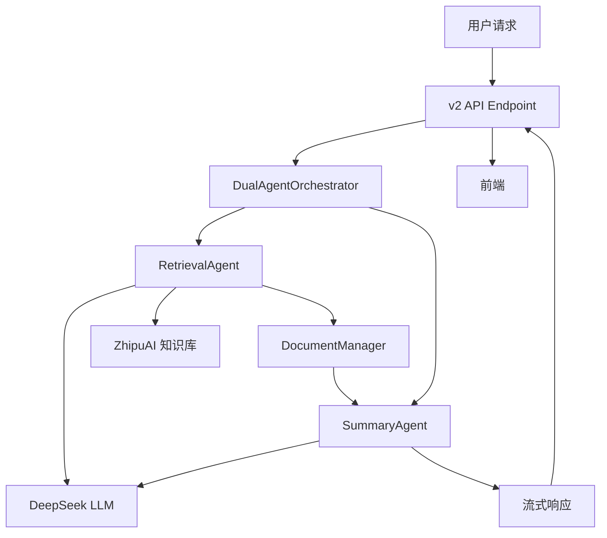

# /api/v2/query 接口详细规格说明

## 概述

`/api/v2/query` 是基于双智能体架构的知识库检索和总结接口。该接口使用 DeepSeek 作为核心 LLM，通过检索智能体和总结智能体的协作，实现智能文档检索、排序和带引用的总结生成。

**核心特性**：
- 双智能体协作（检索 + 总结）
- 多轮自主检索
- 文档自动去重和排序
- 带引用编号的总结
- Server-Sent Events (SSE) 流式响应
- 实时工具调用进度通知

---

## 架构设计

### 系统架构图



### 组件说明

| 组件 | 文件路径 | 职责 |
|------|----------|------|
| **v2 API** | `api/v2_endpoints.py` | HTTP 接口、SSE 事件流管理 |
| **双智能体协调器** | `llm/dual_agent_orchestrator.py` | 协调两个智能体的工作流程 |
| **检索智能体** | `llm/retrieval_agent.py` | 分析问题、多轮检索、文档收集 |
| **总结智能体** | `llm/summary_agent.py` | 文档排序、生成带引用的总结 |
| **文档管理器** | `utils/document_manager.py` | 文档去重、排序、引用编号管理 |
| **检索工具** | `tools/knowledge_retrieval.py` | ZhipuAI 知识库检索封装 |
| **消息协议** | `agent/message_protocol.py` | SSE 消息格式定义 |

---

## API 规格

### 基本信息

- **路径**: `/api/v2/query`
- **方法**: `POST`
- **Content-Type**: `application/json`
- **响应类型**: `text/event-stream` (SSE)

### 请求格式

```json
{
  "query": "string"  // 必填，用户问题
}
```

**示例**：
```json
{
  "query": "大模型攻击有哪些类型？"
}
```

### 响应格式 (SSE)

每个事件的格式：
```
data: <JSON对象>\n\n
```

---

## 消息类型协议

### 消息类型枚举

| 类型码 | 名称 | 说明 |
|--------|------|------|
| 201 | INITIALIZING | 初始化/状态更新消息 |
| 301 | TOOL_CALL_START | 工具调用开始 |
| 302 | TOOL_CALL_END | 工具调用结束 |
| 1 | CONTENT | 正文内容（流式） |
| 204 | REFERENCES | 参考文献列表 |
| 0 | END | 结束标记 |
| 22 | ERROR | 错误消息 |

### 详细消息格式

#### 1. 初始化消息 (201)

```json
{
  "message_type": 201,
  "content": "双智能体正在工作..."
}
```

**用途**：通知用户当前处理状态

**示例序列**：
```json
{"message_type": 201, "content": "双智能体正在工作..."}
{"message_type": 201, "content": "检索智能体正在查找相关文档..."}
{"message_type": 201, "content": "✅ 已检索到 15 个文档，准备生成总结..."}
```

#### 2. 工具调用开始 (301)

```json
{
  "message_type": 301,
  "tool_name": "retrieve_knowledge",
  "arguments": {
    "query": "大模型 攻击",
    "top_k": 5
  }
}
```

**字段说明**：
- `tool_name`: 工具名称，固定为 `"retrieve_knowledge"`
- `arguments`: 工具参数
  - `query`: 检索关键词
  - `top_k`: 返回文档数量（默认5）

#### 3. 工具调用结束 (302)

```json
{
  "message_type": 302,
  "tool_name": "retrieve_knowledge",
  "result": {
    "success": true,
    "results": [
      {
        "content": "文档内容...",
        "source": "文档名称",
        "score": 0.95,
        "chunk_id": "chunk_123",
        "doc_id": "doc_456",
        "doc_url": "https://..."
      }
    ]
  }
}
```

**字段说明**：
- `result.success`: 是否成功
- `result.results`: 检索结果数组
  - `content`: 文档内容
  - `source`: 来源文档名
  - `score`: 相似度分数 (0-1)
  - `chunk_id`: 文档切片唯一ID
  - `doc_id`: 文档ID
  - `doc_url`: 文档链接（可选）

#### 4. 正文内容 (1)

```json
{
  "message_type": 1,
  "content": "根据检索结果，大模型攻击主要包括"
}
```

**特点**：
- 流式输出，每次发送一小段文本
- 需要前端累积拼接
- 包含 Markdown 格式

#### 5. 参考文献 (204)

```json
{
  "message_type": 204,
  "content": [
    {
      "id": 1,
      "source": "AI安全白皮书",
      "content_preview": "提示注入攻击是指攻击者通过精心设计的输入...",
      "chunk_id": "chunk_abc123",
      "doc_id": "doc_xyz789",
      "score": 0.95,
      "doc_url": "https://example.com/doc1"
    },
    {
      "id": 2,
      "source": "大模型安全研究",
      "content_preview": "数据投毒是一种针对训练数据的攻击方式...",
      "chunk_id": "chunk_def456",
      "doc_id": "doc_xyz789",
      "score": 0.89
    }
  ]
}
```

**字段说明**：
- `id`: 引用序号（按相似度排序后分配）
- `source`: 来源文档名
- `content_preview`: 内容预览（前100字符）
- `chunk_id`: 切片唯一ID
- `doc_id`: 文档ID（同一文档的不同切片共享）
- `score`: 相似度分数
- `doc_url`: 文档链接（可选）

#### 6. 结束消息 (0)

```json
{
  "message_type": 0
}
```

#### 7. 错误消息 (22)

```json
{
  "message_type": 22,
  "content": "系统错误: 连接超时"
}
```

---

## 完整事件流示例

```
data: {"message_type":201,"content":"双智能体正在工作..."}

data: {"message_type":201,"content":"检索智能体正在查找相关文档..."}

data: {"message_type":301,"tool_name":"retrieve_knowledge","arguments":{"query":"大模型 攻击","top_k":5}}

data: {"message_type":302,"tool_name":"retrieve_knowledge","result":{"success":true,"results":[...]}}

data: {"message_type":301,"tool_name":"retrieve_knowledge","arguments":{"query":"AI 安全 防御","top_k":5}}

data: {"message_type":302,"tool_name":"retrieve_knowledge","result":{"success":true,"results":[...]}}

data: {"message_type":301,"tool_name":"retrieve_knowledge","arguments":{"query":"提示注入 对抗","top_k":5}}

data: {"message_type":302,"tool_name":"retrieve_knowledge","result":{"success":true,"results":[...]}}

data: {"message_type":201,"content":"✅ 已检索到 15 个文档，准备生成总结..."}

data: {"message_type":1,"content":"根据检索结果"}

data: {"message_type":1,"content":"，大模型攻击"}

data: {"message_type":1,"content":"主要包括以下几类：\n\n"}

data: {"message_type":1,"content":"## 1. 提示注入攻击[1]\n\n"}

data: {"message_type":1,"content":"通过精心设计的输入..."}

data: {"message_type":204,"content":[{"id":1,"source":"AI安全白皮书",...}]}

data: {"message_type":0}
```

---

## 核心实现逻辑

### 1. 双智能体工作流程

```python
async def process(user_query: str):
    # 阶段1: 检索智能体
    doc_manager = None
    async for event in retrieval_agent.retrieve(user_query):
        if event["type"] == "tool_call_start":
            yield {"type": "tool_call_start", ...}
        elif event["type"] == "tool_call_end":
            yield {"type": "tool_call_end", ...}
        elif event["type"] == "retrieval_complete":
            doc_manager = event["doc_manager"]
    
    # 阶段2: 文档排序
    doc_manager.sort_documents(key="score", reverse=True)
    
    # 阶段3: 总结智能体
    async for event in summary_agent.summarize(user_query, doc_manager):
        if event["type"] == "content":
            yield {"type": "content", ...}
    
    # 阶段4: 返回参考文献
    yield {"type": "references", "references": doc_manager.get_references()}
```

### 2. 检索智能体逻辑

```python
class RetrievalAgent:
    async def retrieve(self, user_query: str):
        # 系统提示词：指导多次检索
        system_prompt = """
        - 必须多次调用 retrieve_knowledge 工具
        - 建议调用 2-3 次，使用不同关键词
        - 第1次：主要关键词
        - 第2次：相关概念/同义词
        - 第3次：细分领域/应用场景
        """
        
        while iteration < max_iterations:
            # 调用 DeepSeek
            response = await client.chat.completions.create(
                model="deepseek-chat",
                messages=messages,
                tools=[retrieve_knowledge_tool],
                temperature=0.3
            )
            
            # 执行工具调用
            for tool_call in response.tool_calls:
                yield {"type": "tool_call_start", ...}
                result = await execute_tool(tool_call)
                collect_documents(result)
                yield {"type": "tool_call_end", ...}
        
        yield {"type": "retrieval_complete", "doc_manager": doc_manager}
```

### 3. 文档去重逻辑

```python
class DocumentManager:
    def add_document(self, doc: Document):
        # 使用 chunk_id 计算哈希
        doc_hash = md5(doc.knowledge_id or doc.content)
        
        # 去重
        if doc_hash in self.doc_hash_map:
            return  # 已存在，跳过
        
        # 分配全局索引
        doc.index = len(self.documents) + 1
        self.documents.append(doc)
```

### 4. 文档排序逻辑

```python
def sort_documents(self, key="score", reverse=True):
    # 按相似度分数降序排序
    self.documents.sort(
        key=lambda doc: doc.metadata.get(key, 0),
        reverse=reverse
    )
    
    # 重新分配引用序号
    for idx, doc in enumerate(self.documents, start=1):
        doc.index = idx
```

### 5. 总结智能体逻辑

```python
class SummaryAgent:
    async def summarize(self, user_query: str, doc_manager: DocumentManager):
        # 构建上下文
        context = doc_manager.get_context_for_llm()
        # 格式：[1] 来源：xxx\n内容：xxx
        
        # 系统提示词
        system_prompt = """
        - 必须使用 [1]、[2] 等序号标注引用
        - 序号对应文档编号（已按相关性排序）
        - 只使用文档中的信息，不编造
        """
        
        # 调用 DeepSeek（无工具）
        response = await client.chat.completions.create(
            model="deepseek-chat",
            messages=[
                {"role": "system", "content": system_prompt},
                {"role": "user", "content": f"{user_query}\n\n{context}"}
            ],
            stream=True,
            temperature=0.7
        )
        
        # 流式输出
        async for chunk in response:
            if chunk.delta.content:
                yield {"type": "content", "content": chunk.delta.content}
```

---

## 环境配置

### 必需的环境变量

```bash
# DeepSeek API
DEEPSEEK_API_KEY=sk-xxx
DEEPSEEK_BASE_URL=https://api.deepseek.com
DEEPSEEK_MODEL=deepseek-chat

# ZhipuAI API
ZHIPU_API_KEY=xxx
ZHIPU_KNOWLEDGE_ID=xxx

# 服务配置
HOST=0.0.0.0
PORT=8000
LOG_LEVEL=INFO
```

### 依赖包

```txt
fastapi>=0.104.0
uvicorn>=0.24.0
python-dotenv>=1.0.0
httpx>=0.25.0
pydantic>=2.0.0
pydantic-settings>=2.0.0
zhipuai>=2.0.0
openai>=1.0.0  # DeepSeek 兼容
```

---

## 错误处理

### 常见错误码

| HTTP状态码 | 说明 | 处理方式 |
|-----------|------|----------|
| 400 | 请求参数错误 | 检查 query 字段 |
| 500 | 服务器内部错误 | 查看日志 |
| 502 | 网关错误 | 检查服务状态 |

### SSE 错误消息

```json
{
  "message_type": 22,
  "content": "错误描述"
}
```

**常见错误**：
- `"系统错误: ..."` - 服务器异常
- `"检索过程未返回文档管理器"` - 检索失败
- `"连接超时"` - API 调用超时

---

## 性能指标

### 典型响应时间

| 阶段 | 时间 | 说明 |
|------|------|------|
| 检索（单次） | 1-2秒 | 调用 ZhipuAI API |
| 检索（3次） | 3-6秒 | 多轮检索 |
| 排序 | <100ms | 内存操作 |
| 总结生成 | 5-10秒 | DeepSeek 流式生成 |
| **总计** | **8-16秒** | 完整流程 |

### 资源消耗

- **Token 消耗**：
  - 检索阶段：~500 tokens/次
  - 总结阶段：~2000-5000 tokens
- **内存**：~50MB（包含文档缓存）
- **并发**：建议 ≤10 请求/秒

---

## 测试示例

### Python 客户端

```python
import httpx
import json

async def test_v2_api():
    url = "http://localhost:8000/api/v2/query"
    data = {"query": "大模型攻击"}
    
    async with httpx.AsyncClient(timeout=60.0) as client:
        async with client.stream("POST", url, json=data) as response:
            async for line in response.aiter_lines():
                if line.startswith("data: "):
                    event = json.loads(line[6:])
                    msg_type = event.get("message_type")
                    
                    if msg_type == 201:
                        print(f"[状态] {event['content']}")
                    elif msg_type == 301:
                        print(f"[检索开始] {event['arguments']['query']}")
                    elif msg_type == 302:
                        print(f"[检索完成] 找到 {len(event['result']['results'])} 个文档")
                    elif msg_type == 1:
                        print(event['content'], end='', flush=True)
                    elif msg_type == 204:
                        print(f"\n\n参考文献: {len(event['content'])} 条")
                    elif msg_type == 0:
                        print("\n完成")
```

### cURL 测试

```bash
curl -X POST http://localhost:8000/api/v2/query \
  -H "Content-Type: application/json" \
  -d '{"query":"大模型攻击"}' \
  --no-buffer
```

---

## 扩展说明

### 自定义检索策略

修改 `llm/retrieval_agent.py` 中的系统提示词：

```python
system_prompt = """
你的自定义检索策略...
- 调用次数
- 关键词选择
- 检索范围
"""
```

### 自定义总结风格

修改 `llm/summary_agent.py` 中的系统提示词：

```python
system_prompt = """
你的自定义总结风格...
- 格式要求
- 引用规范
- 语言风格
"""
```

### 添加新的消息类型

1. 在 `agent/message_protocol.py` 中定义新类型
2. 在 `api/v2_endpoints.py` 中处理新事件
3. 更新前端解析逻辑

---

## 版本历史

| 版本 | 日期 | 变更说明 |
|------|------|----------|
| 2.0.0 | 2026-01-13 | 双智能体架构重构 |
| 1.0.0 | 2026-01-08 | 初始版本 |

---

## 附录

### A. 完整代码结构

```
zhiku_agent/
├── api/
│   └── v2_endpoints.py          # v2 API 端点
├── llm/
│   ├── dual_agent_orchestrator.py  # 双智能体协调器
│   ├── retrieval_agent.py       # 检索智能体
│   └── summary_agent.py         # 总结智能体
├── tools/
│   └── knowledge_retrieval.py   # 检索工具
├── utils/
│   ├── document_manager.py      # 文档管理器
│   └── logger.py                # 日志工具
├── agent/
│   └── message_protocol.py      # 消息协议
└── config/
    └── settings.py              # 配置管理
```

### B. 关键数据结构

```python
# Document 类
class Document:
    content: str           # 文档内容
    source: str           # 来源
    knowledge_id: str     # 切片ID（用于去重）
    index: int            # 引用序号（排序后分配）
    metadata: Dict        # 元数据（score, doc_id, doc_url）

# DocumentManager 类
class DocumentManager:
    documents: List[Document]           # 文档列表
    doc_hash_map: Dict[str, int]       # 哈希映射（去重）
    
    def add_document(doc)               # 添加并去重
    def sort_documents(key, reverse)    # 排序并重新分配序号
    def get_context_for_llm()          # 生成LLM上下文
    def get_references()                # 生成参考文献列表
```

---

**文档版本**: 2.0.0  
**最后更新**: 2026-01-14  
**维护者**: AI Research Team
